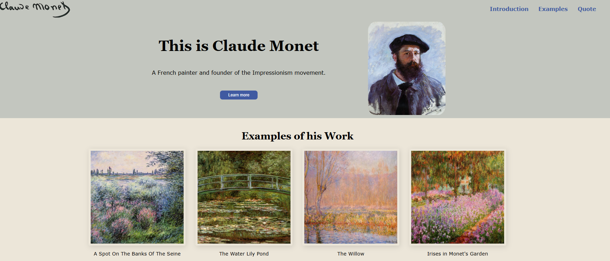

## 🎨 Claude Monet – Landing Page

This is my first landing page project built with HTML and CSS. It showcases the artist Claude Monet.

The goal of this project was to practice the HTML and CSS learned over the TOP Foundations course, with an emphasis on using Flexbox layout.

## 📸 Preview

## 🔗 Resources

[Wikipedia page on Claude Monet](https://en.wikipedia.org/wiki/Claude_Monet)

All pictures were sourced from the [Claude Monet Gallery](https://claudemonetgallery.org/) 